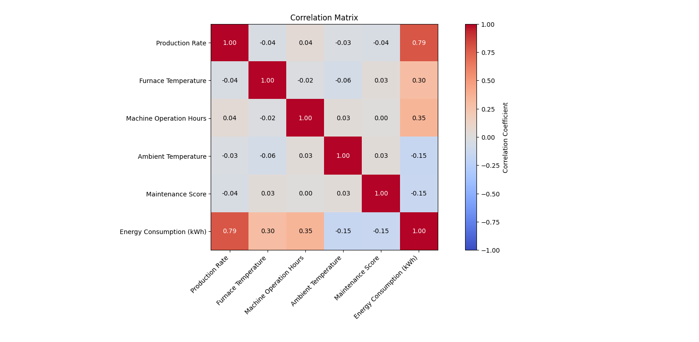
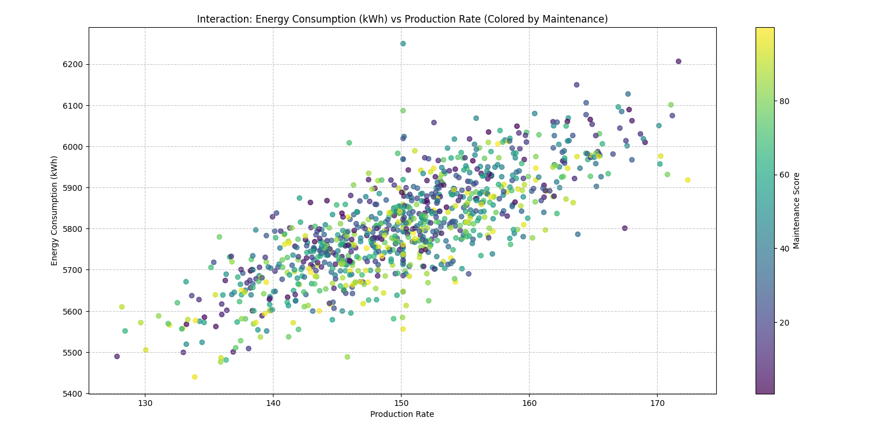
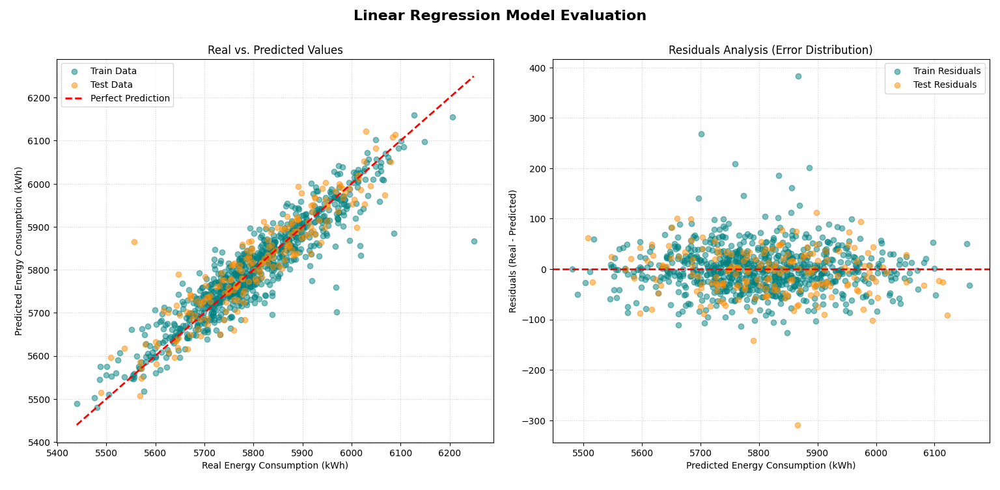

# Industrial Energy Consumption Prediction: Multiple Linear Regression from Scratch 📈

## Overview

This is my first medium-sized Python project as an Industrial
Engineering student, and also my first project that I am publishing on
GitHub.

The project focuses on a simple but realistic engineering problem:
predicting the energy consumption of an industrial plant from a set of
operating conditions. Instead of relying on a Machine Learning library
that hides the mathematics behind the model, I wanted to build the
complete process myself and understand what is happening at each stage.

The project uses Python together with NumPy, Pandas and Matplotlib. The
linear regression model is implemented from scratch using matrix
operations and the Normal Equation.

The main idea is to take raw industrial data, clean and analyse it,
build a Multiple Linear Regression model, evaluate its performance and
finally use it to estimate the energy consumption of a new set of
industrial conditions.

No Scikit-Learn, Statsmodels or other Machine Learning frameworks are
used in the regression model. This was a deliberate decision because the
main purpose of the project is learning and understanding the
mathematical foundations behind linear regression.

## Problem Statement and Engineering Context

Energy consumption is an important factor in industrial environments.
Production levels, furnace temperature, machine operating time and
environmental conditions can all affect the amount of energy required by
a plant.

A model that relates these variables to energy consumption can be useful
for estimating expected consumption under different operating
conditions. It can also provide a simple starting point for analysing
the relationship between production and energy demand.

For this project, I created a synthetic industrial dataset containing
five operational features:

-   **Production Rate**: the production throughput of the plant,
    measured in units per hour.
-   **Furnace Temperature**: the operating temperature of the furnace,
    measured in °C.
-   **Machine Operation Hours**: the amount of time the machinery has
    been operating.
-   **Ambient Temperature**: the temperature of the surrounding
    environment, measured in °C.
-   **Maintenance Score**: a score from 0 to 100 representing the
    maintenance condition of the equipment, where a higher score
    represents a better condition.

The target variable is:

-   **Energy Consumption (kWh)**: the energy consumption associated with
    the corresponding operating conditions.

The dataset is intentionally synthetic. This makes it possible to
control the underlying relationship between the variables and the target
while still creating a dataset that resembles a small industrial data
analysis problem.

## Data and Processing Pipeline

The project is divided into four main Python programs. Each program has
a specific responsibility, and the output of one stage becomes the input
of the next one.

The general process is:

`generator.py` → `raw_data.csv` → `data_cleaning.py` → `clean_data.csv`
→ `analyzer.py` → `linear_regression.py`

### 1. Data Generation

The first stage is handled by `generator.py`.

This script creates approximately 1,000 synthetic observations of an
industrial plant. The five input features are generated using
statistical distributions, and the energy consumption is calculated from
a known set of coefficients plus random noise.

The underlying relationship is based on:

``` text
y = X @ TRUE_COEFFICIENTS + noise
```

The design matrix contains a column of ones so that the model includes
an intercept term.

One of the interesting parts of this stage is that I intentionally
introduce some problems into the generated dataset:

-   missing values (`NaN`);
-   anomalous values in selected variables;
-   duplicated rows.

This gives the following stages a real cleaning task instead of starting
with a perfectly clean dataset.

The random seed is fixed at `42`, so the dataset can be reproduced
consistently.

The generated data is saved as:

``` text
data/raw_data.csv
```

### 2. Data Cleaning

The second stage is handled by `data_cleaning.py`.

This script loads the raw dataset and performs several cleaning
operations:

-   removes duplicated rows;
-   removes rows containing missing values;
-   identifies and removes invalid or anomalous values in
    `Production Rate`;
-   identifies and removes invalid or anomalous values in
    `Machine Operation Hours`.

The cleaning rules are based on the expected physical behaviour of these
industrial variables rather than on more advanced statistical
outlier-detection methods.

The script also checks the resulting dataset to make sure that the main
problems introduced during data generation have been removed.

The cleaned dataset is saved as:

``` text
data/clean_data.csv
```

### 3. Exploratory Data Analysis

The third stage is handled by `analyzer.py`.

Before fitting the regression model, the cleaned data is explored to
understand its basic characteristics.

The analysis includes:

-   general dataset inspection;
-   descriptive statistics;
-   correlation analysis;
-   ranking the linear correlations with energy consumption;
-   a correlation heatmap;
-   feature distributions;
-   scatter plots comparing each feature with the target;
-   boxplots to check for remaining unusual values;
-   conclusions based on the observed data.

The analysis is intentionally simple and visual. The objective is not to
prove causal relationships, but to understand the structure of the
dataset and identify which variables show the strongest linear
relationships with energy consumption.

### Correlation Analysis

The correlation matrix provides a first look at the linear relationships between the variables in the cleaned dataset.



The heatmap helps identify which variables have the strongest linear relationship with energy consumption. These correlations are useful for understanding the dataset, although they should not be interpreted as evidence of causality.

### Feature vs Energy Consumption

The scatter plots allow the relationship between each operational variable and energy consumption to be examined individually.



Some variables show a clearer linear relationship with energy consumption than others. These observations provide useful context before fitting the regression model.

The plots are created using Matplotlib only.

### 4. Multiple Linear Regression

The final stage is handled by `linear_regression.py`.

This is the main mathematical part of the project.

The model uses five input variables and one target variable. First, the
features are separated from the target, and then the Design Matrix is
constructed by adding a column of ones for the intercept.

The resulting matrix has the following general form:

``` text
X = [1  x1  x2  x3  x4  x5]
```

where the five variables correspond to the five industrial features.

The data is then divided manually into training and test sets. I used an
80/20 split and a random seed of `42` so that the same split can be
reproduced.

## The Normal Equation

The regression coefficients are estimated using the Normal Equation:

``` text
β = (XᵀX)⁻¹ Xᵀy
```

This is implemented directly with NumPy matrix operations.

The important part for me was not simply obtaining a prediction, but
understanding what the expression means:

-   `X` is the Design Matrix;
-   `Xᵀ` is its transpose;
-   `XᵀX` represents the relationships between the model features;
-   `(XᵀX)⁻¹` is the inverse of that matrix;
-   `Xᵀy` connects the input variables with the target;
-   `β̂` is the vector of estimated regression coefficients.

The model then makes predictions using:

``` text
ŷ = Xβ
```

The Normal Equation is used directly because this project is intended to
demonstrate the mathematical foundations of Multiple Linear Regression.
More advanced numerical approaches could be used in a production system,
but they are outside the scope of this project.

## Model Evaluation

The model is evaluated separately on the training and test datasets.

Three metrics are calculated manually:

### Mean Squared Error

``` text
MSE = (1/n) Σ(y - ŷ)²
```

MSE measures the average squared prediction error. Larger errors are
penalised more strongly because the residuals are squared.

### Root Mean Squared Error

``` text
RMSE = √MSE
```

RMSE is easier to interpret because it is expressed in the same units as
the target variable, kWh.

### R² Score

``` text
R² = 1 - SS_res / SS_tot
```

R² measures how much of the variation in the target is explained by the
linear model relative to a simple baseline based on the mean target
value.

The metrics are calculated without using Scikit-Learn or other Machine
Learning libraries.

## Comparing the Estimated and Original Coefficients

Because the dataset is synthetic, the coefficients used to generate the
target are known in advance.

The project stores them in:

``` python
TRUE_COEFFICIENTS
```

The final model coefficients, stored in:

``` python
beta_hat
```

are compared directly.

This gives me a useful way to check whether the regression model is able
to recover the relationship that was originally used to generate the
data.

The comparison includes the original coefficient, the estimated
coefficient and their difference. This is particularly useful in a
synthetic dataset because the "true" values are available.

## Visual Model Diagnostics

The regression script produces two main plots.

### Real vs Predicted Values

The first plot compares the actual energy consumption values with the
values predicted by the model.

A perfect model would place every point on the reference line:

``` text
predicted = real
```

The training and test observations are shown separately so that their
behaviour can be compared.

### Residual Plot

The second plot shows the residuals against the predicted values.

The residual is calculated as:

``` text
residual = real - predicted
```

A useful residual plot should generally show errors distributed around
zero without an obvious systematic pattern.

These plots provide a visual complement to MSE, RMSE and R².

## Visual Model Diagnostics

The final model evaluation includes two complementary plots: **Real vs. Predicted Values** and **Residual Analysis**.



The **Real vs. Predicted Values** plot compares the actual energy consumption with the values predicted by the regression model. The dashed diagonal line represents perfect predictions. Most of the points are relatively close to this line, showing that the model is able to capture the main linear relationship between the industrial variables and energy consumption. Training and test data are displayed separately.

The **Residual Analysis** plot shows the prediction errors, calculated as:

```text
residual = real - predicted
```

Most residuals are distributed around zero, which suggests that the model does not show a strong systematic prediction error. A few larger residuals can also be observed, representing observations where the model's prediction differs more substantially from the real value.

Together, these plots provide a visual check of how well the regression model fits the data and where its predictions are less accurate.

## Prediction of New Industrial Conditions

The final part of the project allows the model to estimate energy
consumption for a new set of industrial operating conditions.

The function:

``` python
predict_new_conditions()
```

receives values for:

-   production rate;
-   furnace temperature;
-   machine operation hours;
-   ambient temperature;
-   maintenance score.

These values are transformed into the same structure used by the Design
Matrix, including the bias term, and the prediction is calculated with:

``` text
ŷ = Xβ
```

This makes the project more than just a model-training exercise: it also
demonstrates how the resulting regression equation could be used for a
new industrial scenario.

## Project Structure

The repository is organised as follows:

``` text
Industrial-Energy-Prediction/
│
├── data/
│   ├── raw_data.csv
│   └── clean_data.csv
│
├── generator.py
├── data_cleaning.py
├── analyzer.py
├── linear_regression.py
│
├── README.md
├── requirements.txt
└── .gitignore
```

Each Python file has one main responsibility:

`generator.py` creates the synthetic industrial dataset.

`data_cleaning.py` cleans and validates the generated data.

`analyzer.py` explores the cleaned dataset and produces visualisations.

`linear_regression.py` implements and evaluates the regression model.

## Technologies Used

The project deliberately uses a small set of libraries:

-   **Python** for the overall implementation.
-   **NumPy** for arrays, matrix operations and the regression
    calculations.
-   **Pandas** for loading, cleaning and analysing tabular data.
-   **Matplotlib** for data visualisation.

No Machine Learning framework is required.

## How to Run the Project

First, clone the repository:

``` bash
git clone https://github.com/alejandrohernandezruiz/Industrial-Energy-Prediction.git
cd Industrial-Energy-Prediction
```

Install the required libraries:

``` bash
pip install -r requirements.txt
```

Then run the programs in order.

Generate the raw dataset:

``` bash
python generator.py
```

Clean the data:

``` bash
python data_cleaning.py
```

Run the exploratory analysis:

``` bash
python analyzer.py
```

Finally, train and evaluate the regression model:

``` bash
python linear_regression.py
```

The scripts are designed to be run from the project root directory.

## What I Learned

The main objective of this project was not simply to obtain a good
prediction. I wanted to understand the complete path from raw data to a
working mathematical model.

While developing it, I worked with several concepts that are important
for both programming and engineering:

-   NumPy arrays and matrix operations;
-   matrix multiplication and transposition;
-   the Design Matrix;
-   the Normal Equation;
-   train/test splitting;
-   residuals;
-   MSE, RMSE and R²;
-   data cleaning;
-   correlation analysis;
-   data visualisation;
-   reproducible experiments;
-   structuring a Python project into separate modules;
-   basic Git and GitHub workflow.

It also helped me understand something that is easy to miss when using
high-level Machine Learning libraries: a regression model is ultimately
a mathematical object. Libraries make the implementation convenient, but
understanding what happens underneath is extremely valuable.

## Limitations and Possible Improvements

This project is strictly educational and has deliberate limitations to maintain a clear focus. It uses a synthetic dataset and assumes a simple linear relationship, explicitly implementing the Normal Equation via matrix inversion despite it not being the most efficient method for complex problems. You can consult the original project for more details.

## Final Thoughts

This project is a small step, but it honestly means a lot to me. 

As an industrial engineering student, I really wanted to see how math, coding, and data science work together. 
Building this from scratch helped me connect the dots, instead of just seeing them as separate school subjects.

This is the first big project I feel ready to share. It is not perfect, but thats the point! 
I wanted to make something clean, show the math clearly, and learn how a Python project goes from raw data to a real prediction. 

This repo is just my first step. 🚀
